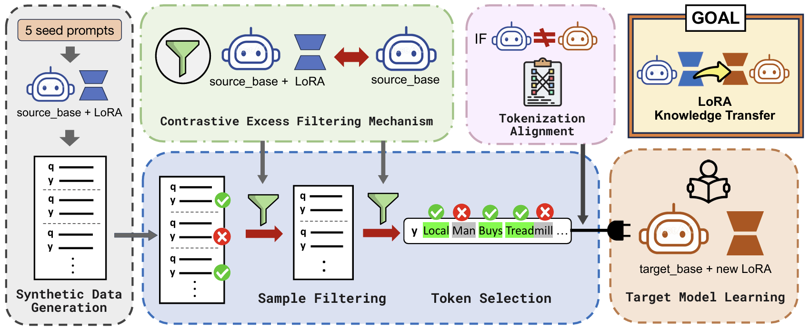

# TiTok: Transfer Token-level Knowledge via Contrastive Excess to Transplant LoRA

<p align="center">
  
</p>

<p align="center">
  
</p>


<p align="center">
  <a href="https://naughtymaltiz16.github.io/titok_project_page/">
    💻 Project Page
  </a> •
  <a href="https://arxiv.org/abs/2510.04682">
    📄 Paper
  </a> •
  <a href="https://github.com/NaughtyMaltiz16/TiTok">
    📂 Code
  </a>
</p>

---

## 🚀 Overview

**TiTok** is a lightweight framework for **LoRA Transplantation**.  
It transfers task-specific knowledge from a source model’s LoRA adapter to a target model **without access to original training data**.

The core idea is **token-wise contrastive excess**, which identifies the most informative tokens and focuses learning on them—making transfer more efficient than sequence-level distillation.

### ✨ Key Features
- 🪄 Synthetic data generation using a source expert model  
- 📊 Token-level excess score computation  
- 🛡️ Two-level filtering (sample + token)  
- 🔗 Tokenizer alignment across architectures  
- 🚀 Efficient target LoRA training with masked supervision  

---


## 📖 Introduction

LoRA adapters are typically tied to their base models. So, LoRA adapters are not transferrable to other base models.
**TiTok solves this limitation** using *token-wise contrastive excess* to selectively train on informative tokens within synthetic data:

S(yᵢ) = Lₑ(yᵢ) - Lₐ(yᵢ)

- Lₑ: expert model loss (with LoRA)  
- Lₐ: amateur model loss (without LoRA)  

This score highlights tokens where the adapter contributes meaningful knowledge.  
Training then focuses only on these high-signal tokens, enabling efficient transfer, even across different tokenizers.

---

## 🔄 Workflow Overview

- 🪄 Generation – Create synthetic data with the source expert
- 📊 Scoring – Compute token-level excess scores
- 🛡️ Sample Filtering – Keep high-signal samples
- 🛡️ Token Selection – Select top k% informative tokens
- 🔗 Alignment – Handle tokenizer mismatch (if needed)
- 🚀 Training – Train target LoRA with masked loss

---

## 📚 Citation
```bibtex
@inproceedings{
  jung2026titok,
  title={TiTok: Transfer Token-level Knowledge via Contrastive Excess to Transplant LoRA},
  author={ChanJoo Jung and Jaehyung Kim},
  booktitle={The Fourteenth International Conference on Learning Representations},
  year={2026},
  url={https://openreview.net/forum?id=0B5K9pIdSK}
}
